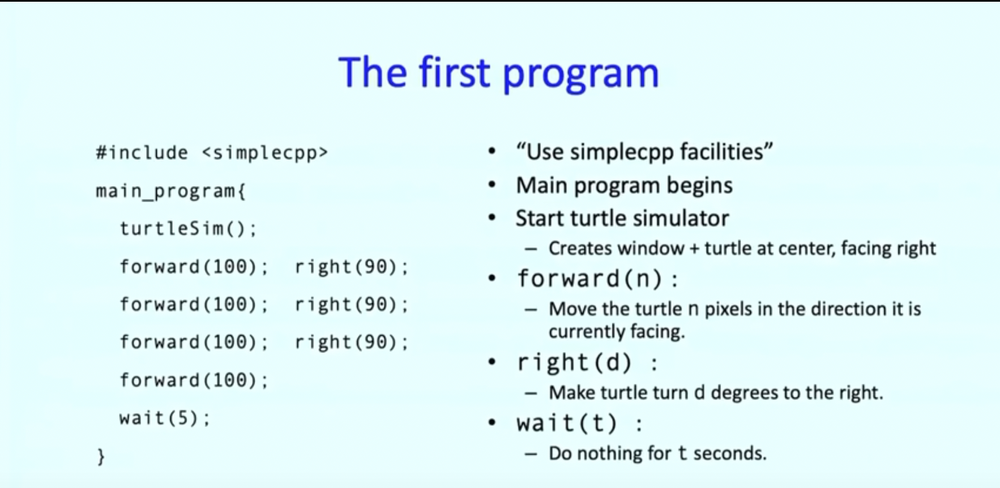
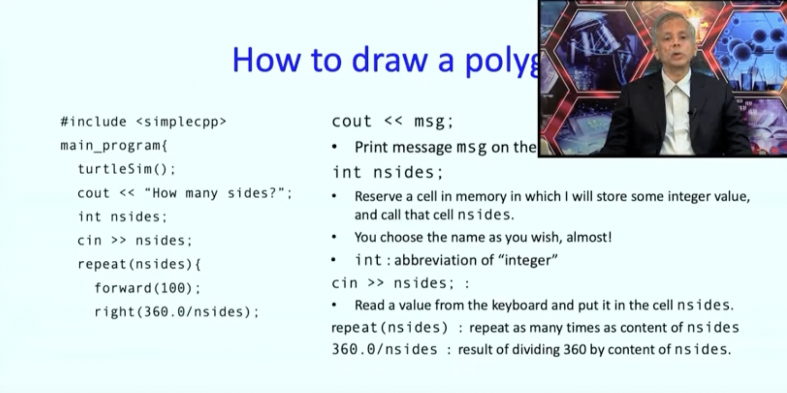

# NOC22 - CS42: An Introduction to Programming Through C++

- Notes and pointers for the [NPTEL Course by Abhiram Ranade](https://nptel.ac.in/courses/106/101/106101208/)
- This repository will be in accordance with the run of [January 2022 - April 2022](https://onlinecourses.nptel.ac.in/noc22_cs42/preview)

## Week 1

### Lecture 1: Introduction

- Computers are everywhere!
- Computer is defined as a giant electrical circuit that can receive data from external world, perform the calculations and send data to external world.
- Calculations depend on the program
- Program: a precise description of calculations we want the computer to perform
- `C++`: Developed by Bjarne Stroustrup in 1985, evolved out of C programming language
- Programming environment provided by [SimpleCPP](https://www.cse.iitb.ac.in/~ranade/simplecpp/) developed by IITB for beginners to programming
- The recommended textbook is written by the author of the course, [Dr. Abhiram Ranade](https://www.cse.iitb.ac.in/~ranade/book.html)
- Introduction to C++ programs using SimpleCPP: **Turtle Simulator** inspired by the **Logo** software created by Seymour Pappert et al. to introduce children to programming.
  
- To run this program:
  - `s++ <fileName>.cpp`
  - `./a.out`
- `repeat` statement: used to avoid redundant work by including the iterative work as the `body` of this statement. Each execution is called `iteration`. Syntax: `repeat(x) { yyy }`. The `repeat` statement causes the statements `yyy` in `{}` to be repeated `x` times.
  
- `left(A)`: turn left `A degrees`. Equivalent to `right(-A)`
- `sqrt(x)`: square root of `x`
- `sine(x)`, `cosine(x)`, `tangent(x)`: `x` should be in degrees
- `sin(x)`, `cos(x)`, `tan(x)`: `x` should be in radians
- `penUp()`, `penDown()`: Causes the pen to be raised, lowered; drawing happens only if the turtle moves while the pen is low
- `cin` and `cout`: used to accept input and produce output respectively

### Lecture 2: Problem Solving using Computer

-
